# ISM Search Workbench

Local-first search, comparison and natural-language analysis for the Australian Information Security Manual.

ISM Search Workbench is a portfolio-grade analyst surface for security practitioners who need to find ASD ISM controls,
compare releases, generate draft governance artefacts and keep current ACSC advisory context close to the control review
workflow.

## Screenshots

### Desktop Workbench

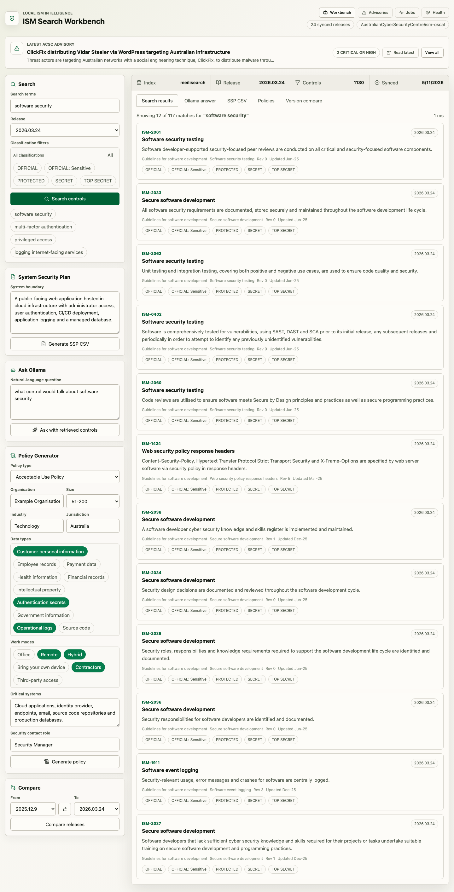

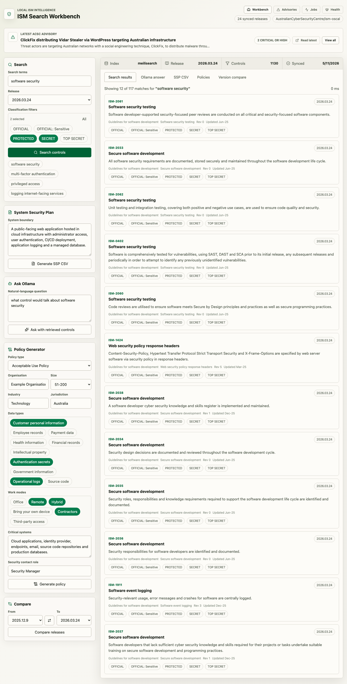

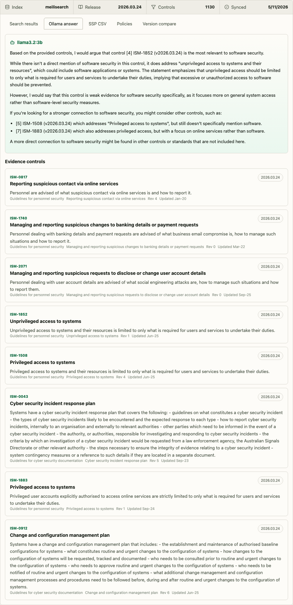

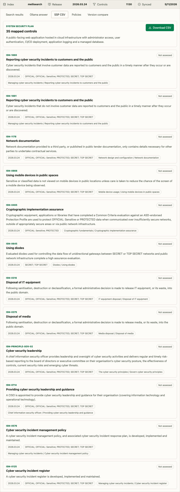

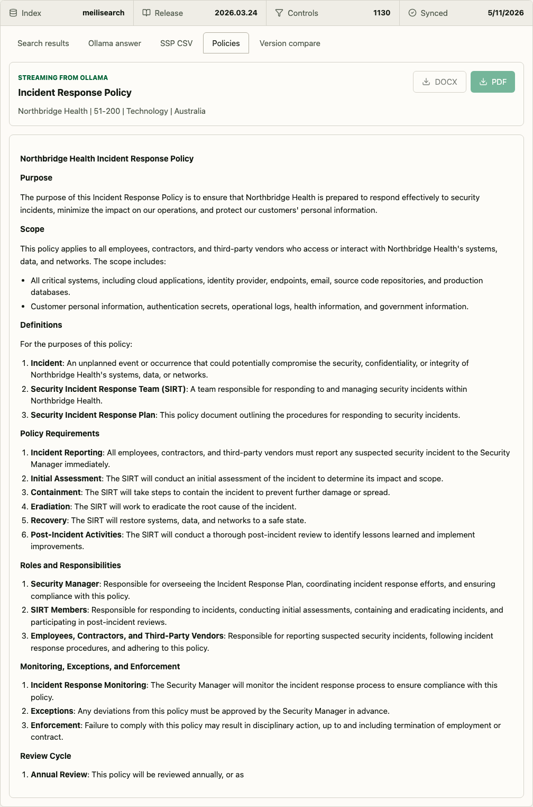

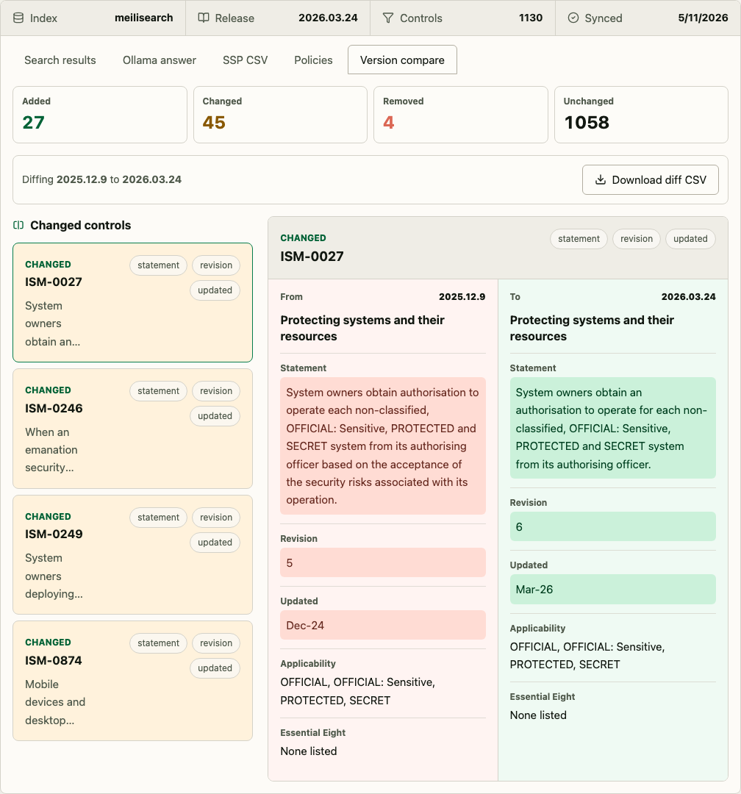

### Intelligence And Operations

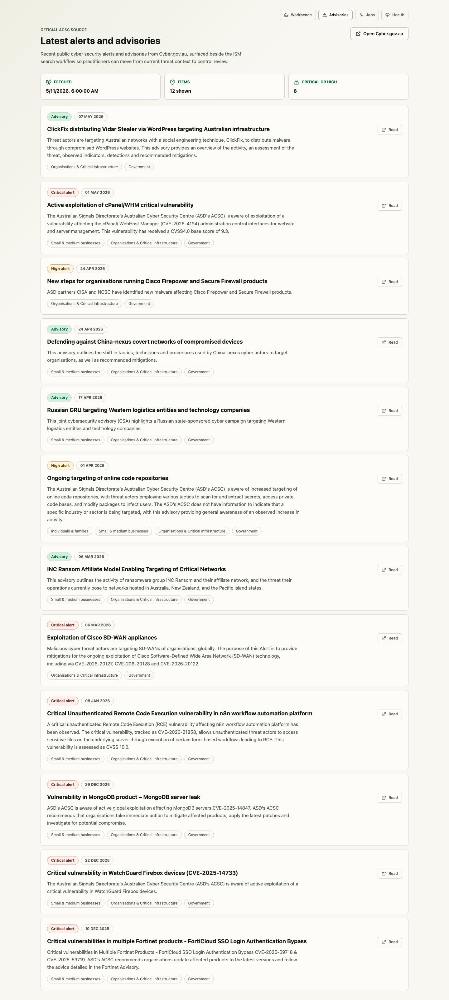

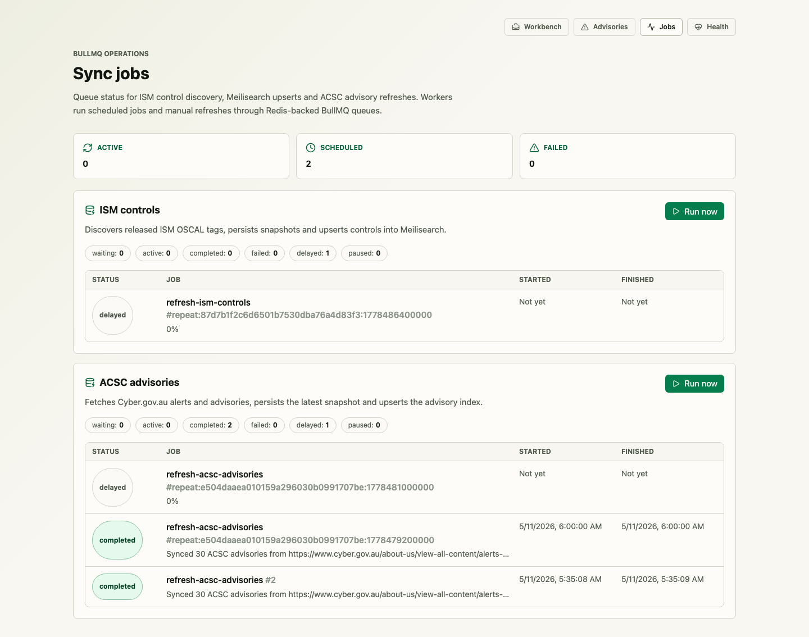

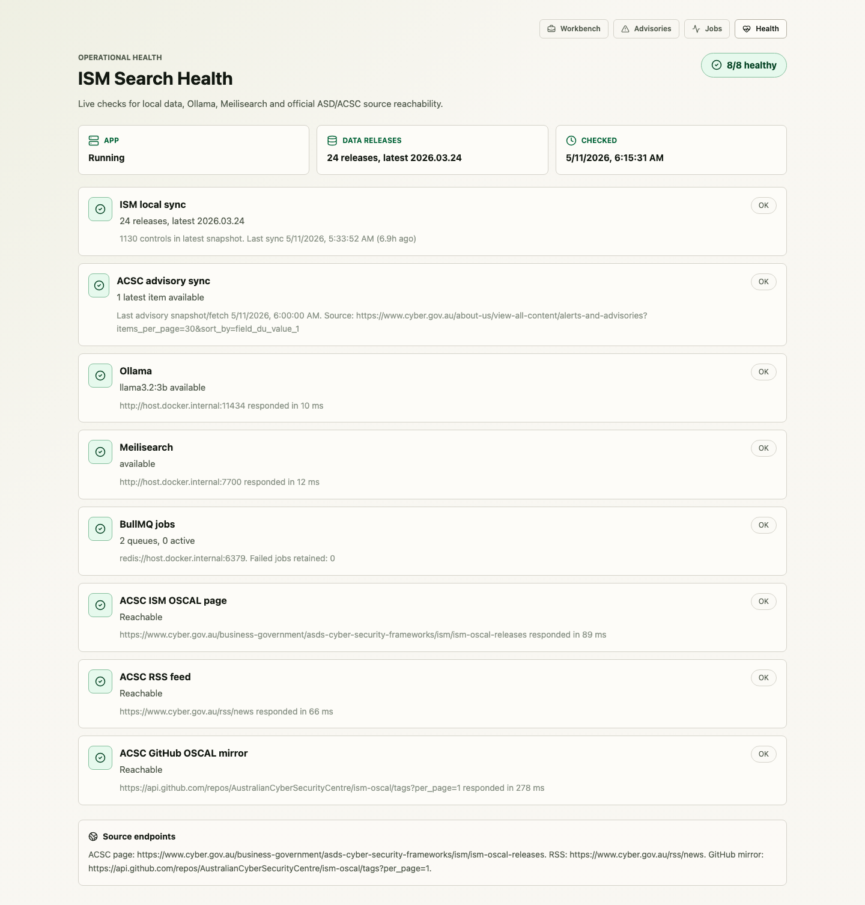

### Mobile

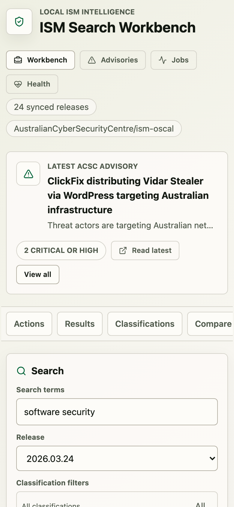

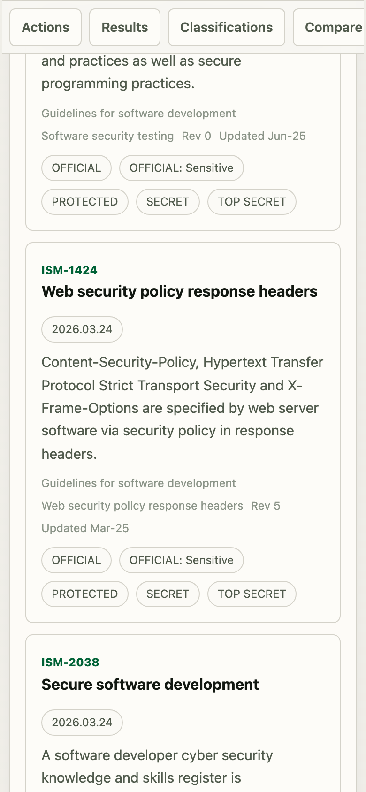

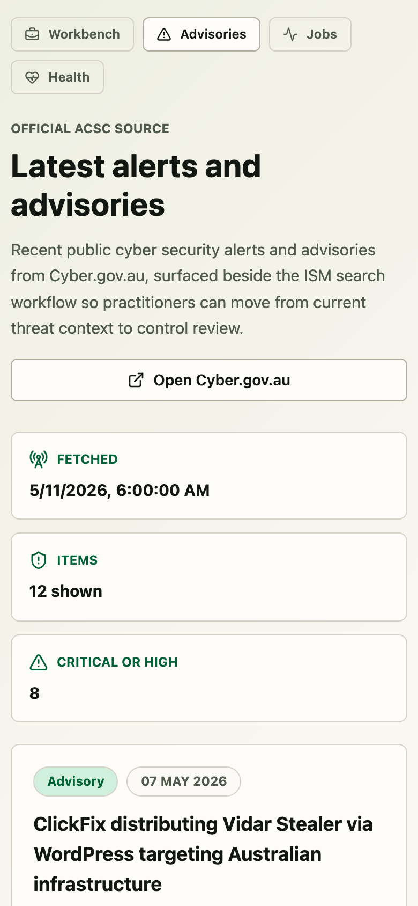

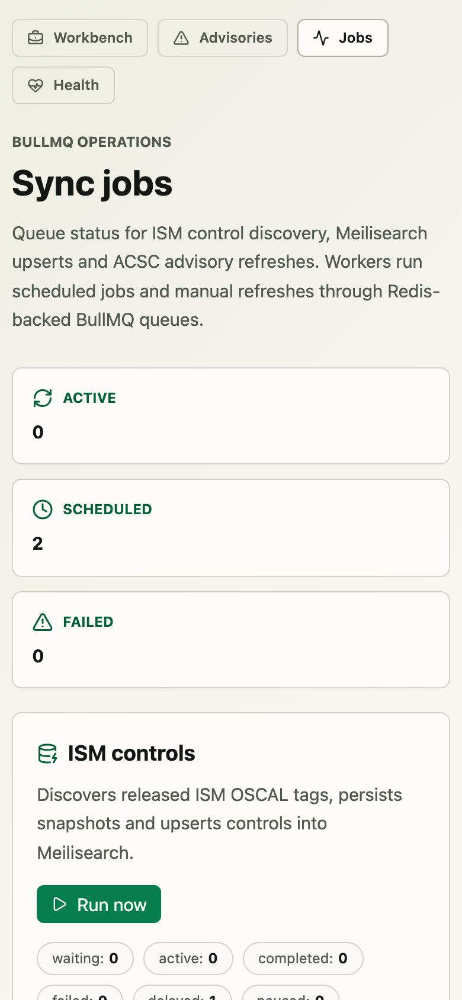

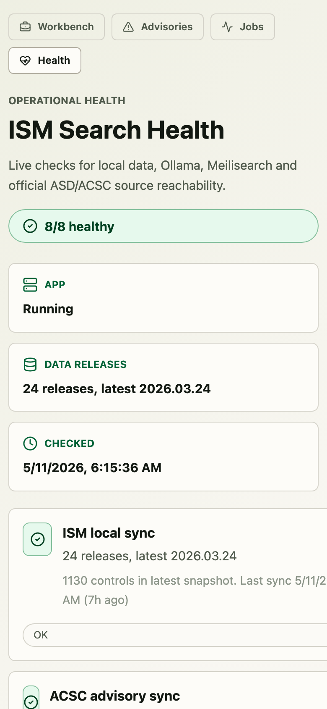

## What It Does

- Searches all synced ISM OSCAL releases with Meilisearch and local JSON fallback.
- Filters controls by classification applicability: OFFICIAL, OFFICIAL: Sensitive, PROTECTED, SECRET and TOP SECRET.
- Compares any two synced ISM versions with changed, added, removed and unchanged counts.
- Shows a side-by-side diff viewer for control text, revision, update and applicability changes.
- Downloads ISM diff results as CSV.
- Lets users describe a system boundary and generate an SSP-style CSV mapped to relevant ISM controls.
- Streams Ollama answers into the UI with rendered markdown previews and evidence controls.
- Generates policy drafts with Ollama for common organisational policies, then downloads DOCX or PDF.
- Persists recent ACSC alerts and advisories from Cyber.gov.au and displays them on the homepage and `/advisories`.
- Runs BullMQ jobs for ISM and ACSC sync work, backed by Redis.
- Shows operational status for data sync, Ollama, Meilisearch, BullMQ, ACSC endpoints and the GitHub OSCAL mirror.

## Routes

| Route | Purpose |
| --- | --- |
| `/` | Main ISM workbench for search, Ollama questions, SSP CSV, policy generation and version diffing. |
| `/advisories` | Recent ACSC alerts and advisories from Cyber.gov.au. |
| `/jobs` | BullMQ queue dashboard with manual refresh buttons for ISM controls and ACSC advisories. |
| `/health` | Live health checks for local data, ACSC sync, Ollama, Meilisearch, BullMQ and official endpoints. |
| `/api/search` | Control search API. |
| `/api/ask` | Streaming Ollama question-answer API. |
| `/api/ssp` | SSP CSV row generation API. |
| `/api/policy` | Streaming policy generation API. |
| `/api/compare` | ISM version diff API. |
| `/api/jobs` | BullMQ status and enqueue API. |
| `/api/versions` | Synced ISM release manifest API. |

All product pages expose consistent navigation back to the workbench, advisories, jobs and health screens.

## Stack

- Next.js 16 App Router with TypeScript
- React 19
- Node `24.14.1` via Docker, with the package engine constrained to Node 24
- Tailwind CSS v4 with local shadcn-style UI primitives
- Meilisearch for local search indexes
- Ollama for local natural-language answers and policy generation
- Redis plus BullMQ for scheduled and manual sync jobs
- ASD ISM OSCAL GitHub mirror for deterministic ISM snapshots
- Cyber.gov.au alerts and advisories page for current ACSC advisory context

## Data Model

ISM sync writes normalized snapshots to:

- `data/ism/manifest.json`
- `data/ism/releases/*.json`

ACSC advisory sync writes:

- `data/acsc/advisories.json`

Meilisearch indexes:

- `ism-controls`
- `acsc-advisories`

The current seeded dataset contains 24 ISM releases, from `v2022.09.14` through `v2026.03.24`, and indexes 23,254
control documents.

## Docker Workflow

Build and run the full stack:

```bash
docker compose up --build
```

The web app is available at:

```text
http://localhost:3001
```

Compose services:

- `web`: Next.js standalone app on port `3001`.
- `seed`: one-shot startup sync for ISM controls and ACSC advisories.
- `worker`: BullMQ worker for recurring sync jobs.
- `redis`: queue backend for BullMQ inside the Compose network.
- `meilisearch`: local search engine on `127.0.0.1:7700`.
- `ollama`: local model server on `127.0.0.1:11434`.

Set local secrets before running Compose:

```bash
cp .env.example .env
# edit MEILI_MASTER_KEY and optionally JOBS_ADMIN_TOKEN
```

Pull the default Ollama model:

```bash
npm run ollama:pull
```

## Local Development

Use Node 24:

```bash
npm install
```

Start supporting services:

```bash
docker compose up -d meilisearch redis ollama
```

Seed local data:

```bash
npm run sync:index
MEILI_HOST=http://localhost:7700 MEILI_MASTER_KEY="$MEILI_MASTER_KEY" npm run sync:acsc
```

Run the worker and app:

```bash
REDIS_URL=redis://localhost:6379 npm run jobs:worker
npm run dev
```

For a faster sample sync during development:

```bash
ISM_RELEASE_COUNT=4 npm run sync:ism
```

## Scripts

| Script | Purpose |
| --- | --- |
| `npm run dev` | Start Next.js development server. |
| `npm run build` | Build the production app and standalone assets. |
| `npm run start` | Start the standalone Next.js server from `.next/standalone`. |
| `npm run lint` | Run ESLint. |
| `npm run sync:ism` | Download and persist ISM OSCAL release snapshots. |
| `npm run sync:acsc` | Fetch and persist ACSC advisories. |
| `npm run sync:index` | Sync all ISM releases into local Meilisearch. |
| `npm run jobs:worker` | Start BullMQ workers for ISM and ACSC refresh jobs. |
| `npm run screenshots` | Capture desktop and mobile Playwright screenshots. |
| `npm run docker:up` | Run `docker compose up --build`. |

## Screenshots And UI Validation

Screenshots are generated with Playwright:

```bash
SCREENSHOT_BASE_URL=http://localhost:3001 npm run screenshots
```

The capture script writes to `docs/screenshots` and drives the real UI through:

- search results
- classification filtering
- streaming Ollama answers
- SSP CSV generation
- policy generation
- version diffing
- ACSC advisories
- BullMQ jobs
- health checks
- mobile workbench, advisories, jobs and health screens

During capture it also performs lightweight accessibility and responsive checks:

- every link and button must have an accessible name
- each captured viewport must avoid horizontal overflow

## Accessibility And Responsive Notes

- Product pages include a skip-to-content link.
- Primary navigation is consistent across the workbench, advisories, jobs and health routes.
- Mobile workbench screens include shortcut links for actions, results, classification filters and version comparison.
- Non-text status indicators include text labels, not only color.
- Long endpoint URLs and job metadata wrap instead of forcing horizontal scrolling.

## Security Hardening

- Docker publishes app, Meilisearch and Ollama on loopback only.
- The production web container runs as a non-root user with a read-only filesystem, no Linux capabilities and `no-new-privileges`.
- Security headers are set globally, including CSP, `X-Frame-Options`, `X-Content-Type-Options`, `Referrer-Policy` and a restrictive permissions policy.
- API inputs are bounded and validated with Zod, including ISM version format and classification allowlists.
- LLM and job-triggering endpoints use in-memory rate limits.
- Job enqueue requests reject cross-site submissions and can require `JOBS_ADMIN_TOKEN` when configured.
- CSV exports neutralize spreadsheet formula injection by prefixing formula-like cells.
- Ollama prompts treat user text as untrusted and bound generated token counts/timeouts.

## Source Material

- ISM OSCAL repository: `AustralianCyberSecurityCentre/ism-oscal`
- ACSC advisories: `https://www.cyber.gov.au/about-us/view-all-content/alerts-and-advisories`
- ACSC RSS context: `https://www.cyber.gov.au/rss/news`

## Disclaimer

This project is a local workbench for search, drafting and analysis. It is not an authoritative source of ISM guidance.
Always verify compliance, risk and policy decisions against the official ASD and ACSC publications.
